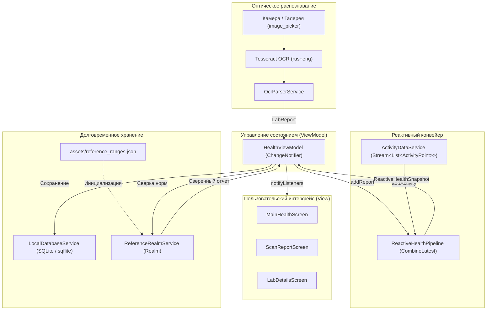

# Medical Diary (Медицинский дневник)

Кроссплатформенное мобильное приложение для персонального мониторинга самочувствия, оцифровки печатных лабораторных бланков с помощью оптического распознавания текста (OCR), долговременного структурированного хранения медицинских показателей и реактивного сопоставления данных с физической активностью.

Проект разработан в рамках дисциплины **«Разработка приложений для iPhone и iPad»** (вариант 12: *«Мобильный медицинский дневник со сканером бланков лабораторных анализов»*). Приложение выполнено на базе фреймворка **Flutter** (Dart, Material 3) с прицелом на кроссплатформенность (Android/iOS) и протестировано на физическом устройстве **Huawei nova Y61** (Android).

---

## Содержание

- [О проекте](#о-проекте)
- [Реализованный функционал по лабораторным работам](#реализованный-функционал-по-лабораторным-работам)
  - [Лабораторная работа №1 — Пользовательский интерфейс](#лабораторная-работа-1--пользовательский-интерфейс)
  - [Лабораторная работа №2 — Архитектура и лабораторные исследования](#лабораторная-работа-2--архитектура-и-лабораторные-исследования)
  - [Лабораторная работа №3 — Долговременное хранение данных (SQLite + Realm)](#лабораторная-работа-3--долговременное-хранение-данных-sqlite--realm)
  - [Лабораторная работа №4 — Реактивная обработка и интеграция данных](#лабораторная-работа-4--реактивная-обработка-и-интеграция-данных)
- [Архитектура приложения](#архитектура-приложения)
  - [Паттерн MVVM](#паттерн-mvvm)
  - [Конвейер обработки лабораторного исследования](#конвейер-обработки-лабораторного-исследования)
  - [Mermaid-диаграмма архитектуры](#mermaid-диаграмма-архитектуры)
- [Технологический стек](#технологический-стек)
- [Структура проекта](#структура-проекта)
- [Инструкция по установке и запуску](#инструкция-по-установке-и-запуску)
- [Проверка функциональности](#проверка-функциональности)
- [Скриншоты и демонстрация](#скриншоты-и-демонстрация)
- [Ограничения проекта](#ограничения-проекта)

---

## О проекте

**Medical Diary** решает задачу централизованного ведения медицинского профиля пациента:
- регистрация субъективных жалоб и объективных физиологических метрик (пульс, температура, тяжесть состояния);
- визуальный контроль динамики самочувствия на интерактивных графиках;
- автоматизированный ввод лабораторных анализов с бумажных бланков через камеру устройства или галерею с помощью встроенного Tesseract OCR;
- локальное персистентное хранение данных в реляционной базе данных SQLite с поддержкой внешних ключей и транзакций;
- ведение нормативно-справочной базы медицинских референсных диапазонов в нереляционной базе данных Realm с учетом пола и возраста пациента;
- асинхронное объединение потока лабораторных данных и потока двигательной активности на базе реактивных потоков Dart Streams (паттерн CombineLatest).

---

## Реализованный функционал по лабораторным работам

### Лабораторная работа №1 — Пользовательский интерфейс
- **Интерактивный ввод симптомов:** выбор жалоб через чипы (`FilterChip`), регулировка тяжести состояния от 1 до 10 и замера частоты пульса (50–140 уд/мин) с помощью ползунков (`Slider`).
- **График динамики показателей:** отображение пульса во времени на базе линейного векторного графика (`LineChart` из библиотеки `fl_chart`) с плавной интерполяцией и заливкой области.
- **Хронологическая лента здоровья:** динамический список записей самочувствия с форматированием даты (`intl`), выводом перечня зафиксированных симптомов и цветовой дифференциацией тяжести (зеленый/красный маркер).
- **Реактивное обновление UI:** мгновенный отклик интерфейса при добавлении новых записей через `ChangeNotifier` и `ListenableBuilder`.

### Лабораторная работа №2 — Архитектура и лабораторные исследования
- **Расширение MVVM:** выделение самостоятельных сущностей предметной области `LabMarker` (отдельный показатель) и `LabReport` (комплексный отчет исследования).
- **Карточки исследований:** список ранее проведенных анализов (ОАК, биохимический профиль) с указанием лаборатории, даты забора биоматериала и количества выявленных отклонений.
- **Индикация отклонений от нормы:** экран детального просмотра `LabDetailsScreen`, в котором каждый маркер подсвечивается зеленым («В норме»), красным («Выше нормы») или оранжевым («Ниже нормы») с наглядными стрелками-индикаторами.
- **Модуль сканирования:** экран `ScanReportScreen` с интеграцией плагина `image_picker` для получения снимка бланка как напрямую с камеры, так и из галереи устройства.
- **Разграничение режимов:** первоначальный демонстрационный набор исследований отделен от логики динамического добавления новых бланков.

### Лабораторная работа №3 — Долговременное хранение данных (SQLite + Realm)
- **Основная реляционная БД (SQLite через `sqflite`):**
  - Создание схемы из 4 связанных таблиц:
    - `health_entries` — записи субъективного самочувствия;
    - `health_entry_symptoms` — симптомы, привязанные к записи (связь 1:M);
    - `lab_reports` — карточки лабораторных исследований;
    - `lab_markers` — показатели анализов, привязанные к отчету (связь 1:M).
  - Включение поддержки внешних ключей (`PRAGMA foreign_keys = ON`) и каскадное удаление дочерних записей (`ON DELETE CASCADE`).
  - Транзакционная запись данных (`db.transaction`) и пакетное добавление через `Batch`.
  - Полное сохранение состояния: все добавленные записи и отсканированные анализы переживают закрытие и перезапуск приложения.
- **Вспомогательная нереляционная БД (Realm):**
  - Реализация справочника медицинских референсных диапазонов на базе `realm` (схема `MedicalReference`).
  - Хранение полей: нормализованный ключ маркера, отображаемое имя, пол (`all`, `male`, `female`), возрастные рамки (`minAge`, `maxAge`), интервал нормы (`minValue`, `maxValue`), единица измерения и источник.
  - Первичная инициализация (seeding) локальной базы Realm из встроенного ресурса `assets/reference_ranges.json` при первом запуске.

### Лабораторная работа №4 — Реактивная обработка и интеграция данных
- **Локальный OCR-движок:** автономное распознавание текста на устройстве через `flutter_tesseract_ocr` (движок Tesseract, языковые пакеты `rus` и `eng` из каталога `assets/tessdata`). Работает полностью оффлайн, без сторонних облачных API.
- **Парсинг печатных бланков (`OcrParserService`):**
  - Определение лаборатории («Хеликс», «Инвитро», «Гемотест») по ключевым сигнатурам;
  - Детекция типа анализа (общий анализ мочи, ОАК, биохимия) и даты забора/выполнения исследования;
  - Парсинг строк таблицы с сопоставлением алиасов показателей, числовых значений и единиц измерения.
- **Нормализация и сверка со справочником Realm (`ReferenceRealmService`):**
  - Подстановка официальных референсных норм из Realm взамен норм, напечатанных на самом бланке, с учетом заданного пола и возраста пользователя.
- **Реактивный конвейер (`ReactiveHealthPipeline`):**
  - Реализация логики `CombineLatest` на базе потоков Dart (`StreamController.broadcast`).
  - Объединение независимого потока последнего лабораторного исследования (`LabReport`) и потока физической активности за 7 дней (`List<ActivityPoint>`).
  - Генерация агрегированного снимка состояния `ReactiveHealthSnapshot` (расчет суммарного и среднего количества шагов, активных минут, сопоставление с числом лабораторных отклонений).
- **Учебный источник активности (`ActivityDataService`):**
  - В связи с тем, что оригинальный фреймворк Apple HealthKit доступен исключительно в среде iOS, а тестирование приложения производилось на Android-устройстве (Huawei), системный источник физической активности вынесен в изолированный локальный адаптер с идентичным асинхронным Stream-интерфейсом.

---

## Архитектура приложения

### Паттерн MVVM

Приложение строго следует архитектуре **Model-View-ViewModel (MVVM)** с выделением сервисного слоя:

```
┌─────────────────────────────────────────────────────────────┐
│                           VIEW                              │
│   MainHealthScreen   │   ScanReportScreen   │  LabDetails   │
└──────────────────────────────▲──────────────────────────────┘
                               │ UI State / ListenableBuilder
┌──────────────────────────────▼──────────────────────────────┐
│                         VIEWMODEL                           │
│                      HealthViewModel                        │
└───────┬──────────────────────┬──────────────────────┬───────┘
        │                      │                      │
┌───────▼────────┐      ┌──────▼────────┐      ┌──────▼────────┐
│    SERVICES    │      │    SERVICES   │      │    SERVICES   │
│ LocalDatabase  │      │ReferenceRealm │      │ReactiveHealth │
│ (SQLite DB)    │      │ (Realm DB)    │      │   Pipeline    │
└───────┬────────┘      └──────┬────────┘      └──────┬────────┘
        │                      │                      │
┌───────▼──────────────────────▼──────────────────────▼───────┐
│                            MODEL                            │
│  HealthEntry │ LabReport │ MedicalReference │ ActivityPoint │
└─────────────────────────────────────────────────────────────┘
```

1. **Model (`lib/models/`):**
   - [HealthEntry](file:///D:/project/medical_diary/lib/models/health_entry.dart) — модель записи дневника (дата, пульс, температура, симптомы, тяжесть).
   - [LabReport](file:///D:/project/medical_diary/lib/models/lab_report.dart), [LabMarker](file:///D:/project/medical_diary/lib/models/lab_report.dart) — сущности лабораторного бланка и конкретного аналитического показателя.
   - [MedicalReference](file:///D:/project/medical_diary/lib/models/medical_reference.dart) — сущность референсной нормы Realm.
   - [ActivityPoint](file:///D:/project/medical_diary/lib/models/activity_point.dart) — точка графика суточной активности (шаги, минуты).
   - [ReactiveHealthSnapshot](file:///D:/project/medical_diary/lib/models/reactive_health_snapshot.dart) — комбинированный снимок лабораторных показателей и физической активности.
2. **View (`lib/views/`):**
   - [MainHealthScreen](file:///D:/project/medical_diary/lib/views/main_health_screen.dart) — главный экран, объединяющий карточки ввода, график пульса, блок ЛР №4 с графиком активности, статус баз данных SQLite/Realm и ленту самочувствия.
   - [ScanReportScreen](file:///D:/project/medical_diary/lib/views/scan_report_screen.dart) — экран захвата фотографии бланка, запуска распознавания и вывода сводного диалога.
   - [LabDetailsScreen](file:///D:/project/medical_diary/lib/views/lab_details_screen.dart) — экран детального изучения маркеров с цветовой дифференциацией нормы.
3. **ViewModel (`lib/viewmodels/`):**
   - [HealthViewModel](file:///D:/project/medical_diary/lib/viewmodels/health_viewmodel.dart) — центральный координатор состояния, связывающий сервисы хранения, конвейер потоков и пользовательский интерфейс через `ChangeNotifier`.
4. **Services (`lib/services/`):**
   - [LocalDatabaseService](file:///D:/project/medical_diary/lib/services/local_database_service.dart) — реляционные операции с SQLite.
   - [ReferenceRealmService](file:///D:/project/medical_diary/lib/services/reference_realm_service.dart) — документное хранилище норм Realm и селектор по возрасту/полу.
   - [OcrParserService](file:///D:/project/medical_diary/lib/services/ocr_parser_service.dart) — запуск Tesseract OCR и извлечение таблицы маркеров.
   - [ActivityDataService](file:///D:/project/medical_diary/lib/services/activity_data_service.dart) — генерация и обновление потока двигательной активности.
   - [ReactiveHealthPipeline](file:///D:/project/medical_diary/lib/services/reactive_health_pipeline.dart) — конвейер объединения потоков (CombineLatest).

### Конвейер обработки лабораторного исследования

Последовательность шагов при оцифровке медицинского бланка:

$$\text{Фото бланка} \longrightarrow \text{Tesseract OCR} \longrightarrow \text{OcrParserService} \longrightarrow \text{LabReport} \longrightarrow \text{Realm} \longrightarrow \text{SQLite} \longrightarrow \text{ReactivePipeline} \longrightarrow \text{ViewModel} \longrightarrow \text{UI}$$

### Mermaid-диаграмма архитектуры



---

## Технологический стек

| Технология / Пакет | Версия | Назначение в проекте |
| :--- | :--- | :--- |
| **Dart** | `^3.7.0` | Основной строго типизированный язык программирования |
| **Flutter** | SDK | Фреймворк для создания кроссплатформенного UI с поддержкой Material 3 |
| **fl_chart** | `1.0.0` | Построение интерактивных графиков: линейного графика пульса и столбчатой диаграммы активности |
| **intl** | `^0.20.2` | Форматирование дат и времени в медицинских записях и бланках |
| **image_picker** | `^1.2.1` | Получение фотоснимков лабораторных бланков с камеры устройства или из галереи |
| **flutter_tesseract_ocr** | `^0.4.31` | Локальное оптическое распознавание текста (OCR) на базе Tesseract без обращения к сети |
| **sqflite** | `^2.4.2` | Реляционная база данных SQLite для сохранения записей самочувствия и карточек анализов |
| **path** | `^1.9.1` | Управление путями к файлам локальной базы данных |
| **realm** | `^20.2.0` | Встраиваемая документная NoSQL БД для хранения и быстрого поиска референсных диапазонов |
| **flutter_lints** | `^5.0.0` | Статический анализ кода и соблюдение стандартов оформления Dart |

---

## Структура проекта

```text
medical_diary/
├── android/                             # Нативная сборка и манифесты Android
│   └── app/src/main/AndroidManifest.xml # Разрешения и параметры приложения
├── assets/                              # Локальные ресурсы приложения
│   ├── reference_ranges.json            # Исходный набор референсных медицинских норм
│   ├── tessdata_config.json             # Конфигурация доступных словарей Tesseract
│   └── tessdata/                        # Языковые модели OCR
│       ├── eng.traineddata              # Английская модель распознавания
│       └── rus.traineddata              # Русская модель распознавания
├── ios/                                 # Нативная конфигурация iOS
├── lib/                                 # Исходный код приложения (Flutter)
│   ├── main.dart                        # Точка входа: инициализация БД, Realm и ViewModel
│   ├── models/                          # Слой сущностей (Model)
│   │   ├── activity_point.dart          # Модель временной точки физической активности
│   │   ├── health_entry.dart            # Модель записи самочувствия (пульс, симптомы)
│   │   ├── lab_report.dart              # Модели лабораторного отчета (LabReport, LabMarker)
│   │   ├── medical_reference.dart       # Realm-схема медицинских норм
│   │   ├── medical_reference.realm.dart # Сгенерированный Realm-адаптер
│   │   └── reactive_health_snapshot.dart# Снимок объединенного реактивного состояния
│   ├── services/                        # Сервисный слой
│   │   ├── activity_data_service.dart   # Локальный поток данных активности
│   │   ├── local_database_service.dart  # Реляционное хранилище SQLite (sqflite)
│   │   ├── ocr_parser_service.dart      # OCR-распознавание и парсер структуры бланков
│   │   ├── reactive_health_pipeline.dart# Конвейер объединения потоков (CombineLatest)
│   │   └── reference_realm_service.dart # Документное хранилище норм (Realm)
│   ├── viewmodels/                      # Слой бизнес-логики (ViewModel)
│   │   └── health_viewmodel.dart        # Центральная ViewModel (ChangeNotifier)
│   └── views/                           # Слой представления (View)
│       ├── lab_details_screen.dart      # Экран маркеров исследования и подсветки отклонений
│       ├── main_health_screen.dart      # Главный экран дневника, графиков и статусов
│       └── scan_report_screen.dart      # Экран сканирования и распознавания бланков
├── test/                                # Тесты проекта
│   └── widget_test.dart                 # Базовый smoke-тест виджетов
├── tools/                               # Вспомогательные скрипты
│   └── setup_lab3.ps1                   # Скрипт подготовки зависимостей и генерации Realm
├── LAB3_IMPLEMENTATION.md               # Отчет по реализации лабораторной работы №3
├── LAB4_IMPLEMENTATION.md               # Отчет по реализации лабораторной работы №4
├── PATCH_README.txt                     # Руководство по накатыванию патча
├── pubspec.yaml                         # Манифест пакетов и ресурсов Flutter
└── pubspec.lock                         # Лок-файл версий зависимостей
```

---

## Инструкция по установке и запуску

### Системные требования
- Установленный **Flutter SDK** (версия `>= 3.29.0`, Dart SDK `>= 3.7.0`).
- Среда разработки: **VS Code** или **Android Studio** с плагинами Flutter и Dart.
- **Android SDK** (API Level 21+) или реальное устройство с включенной «Отладкой по USB».

### Шаги запуска

1. **Клонирование репозитория:**
   ```bash
   git clone https://github.com/alexlawren/medical_diary.git
   cd medical_diary
   ```

2. **Загрузка зависимостей:**
   ```bash
   flutter pub get
   ```

3. **Кодогенерация схемы Realm:**
   Файл `lib/models/medical_reference.realm.dart` уже зафиксирован в репозитории. При необходимости перегенерации выполните:
   ```bash
   dart run realm generate
   ```
   *(Также в каталоге `tools/` доступен вспомогательный скрипт `tools/setup_lab3.ps1`).*

4. **Подключение устройства и запуск:**
   - Подключите смартфон (например, Huawei nova Y61) по USB-кабелю.
   - Проверьте доступность устройства:
     ```bash
     flutter devices
     ```
   - Запустите приложение в режиме отладки:
     ```bash
     flutter run
     ```

### Особенности разрешений и ресурсов
- **Камера и память:** плагин `image_picker` запрашивает доступ к камере (`android.permission.CAMERA`) и чтению изображений во время первого вызова.
- **Tesseract OCR:** языковые модели (`assets/tessdata/rus.traineddata` и `eng.traineddata`) включены в сборку через секцию `assets` файла `pubspec.yaml`. Подключение к сети интернет для распознавания **не требуется**.

---

## Проверка функциональности

Пользователь и проверяющий могут протестировать все 4 лабораторные работы по следующему сценарию:

1. **Добавление записи дневника (ЛР №1):**
   - На главном экране выберите один или несколько симптомов («Головная боль», «Слабость»).
   - Передвиньте ползунок тяжести (например, на 7) и пульса (например, на 88 уд/мин).
   - Нажмите **«Сохранить запись»**.
   - Новая запись появится в ленте «Хроника самочувствия», а график пульса мгновенно перестроится.
2. **Просмотр лабораторных анализов (ЛР №2):**
   - Прокрутите экран до блока «Лабораторные анализы».
   - Откройте карточку «Общий анализ крови (ОАК)».
   - В открывшемся окне проверьте подсветку: показатели вне нормы выделены красным/оранжевым цветом с бейджами («Выше нормы», «Ниже нормы»).
3. **Проверка долговременного сохранения (ЛР №3):**
   - В блоке «Хранилища данных» обратите внимание на счетчики: количество записей SQLite и референсов Realm (7 записей).
   - Полностью закройте приложение (смахните из списка недавних задач).
   - Откройте приложение снова: все добавленные записи дневника и карточки анализов сохранились на месте.
4. **Сканирование бланка и распознавание (ЛР №2 + ЛР №4):**
   - Нажмите плавающую кнопку **«Скан бланка»** в правом нижнем углу.
   - Сфотографируйте тестовый бланк анализа мочи (или выберите файл из галереи).
   - Дождитесь завершения работы Tesseract OCR.
   - В появившемся диалоге убедитесь в сверке с Realm (строка *«Сверено с Realm: ...»*).
   - Нажмите «Открыть карточку» — откроется детальный отчет с нормативами, подтянутыми из Realm.
5. **Реактивное обновление и CombineLatest (ЛР №4):**
   - В блоке «Реактивная обработка • ЛР №4» проверьте отображение графика физической активности за 7 дней.
   - Выберите пол («Женский» / «Мужской») и возрастную категорию.
   - Нажмите **«Обновить поток»**: данные текущего дня в потоке активности обновятся, а карточка объединенного снимка пересчитает среднее количество шагов и свяжет их с последним исследованием.

---

## Скриншоты и демонстрация

> [!NOTE]
> Приложение успешно собрано, развернуто и протестировано на физическом устройстве **Huawei nova Y61**.  
> Во избежание неоправданного увеличения объема Git-репозитория бинарные скриншоты интерфейса и видеозаписи работы не включены в состав репозитория кода и оформлены в соответствующих отчетах по лабораторным работам (файлы `LAB3_IMPLEMENTATION.md`, `LAB4_IMPLEMENTATION.md` и документация отчетов).

---

## Ограничения проекта

1. **Учебный источник физической активности:** фреймворк **Apple HealthKit** доступен исключительно на устройствах под управлением iOS и watchOS. Поскольку отладка и демонстрация проекта производились на смартфоне с ОС Android (Huawei), класс `ActivityDataService` реализован как учебный локальный адаптер со стандартным Stream-интерфейсом. Он не производит прямого чтения данных из HealthKit или Google Health Connect.
2. **Ограничения оптического распознавания (OCR):** качество распознавания Tesseract OCR напрямую зависит от освещения, угла съемки, разрешения камеры, четкости линий таблицы и отсутствия геометрических искажений или бликов на бумаге.
3. **Учебный характер референсных норм:** медицинские нормы в `assets/reference_ranges.json` и Realm служат исключительно целям архитектурной демонстрации и не являются основанием для постановки медицинских диагнозов.
4. **Статус программного обеспечения:** приложение разработано в академических целях и не является сертифицированным медицинским изделием.